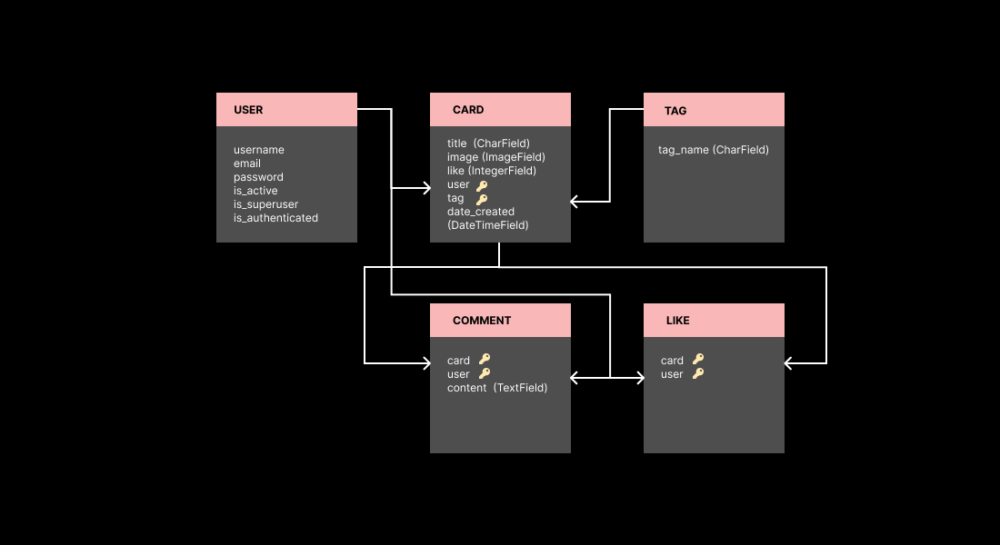

# Project 2

### WishCraft

## Groupe member

- Aleksandra
- André
- Andres
- Maiko
- Tischa

## Visuals

Wireframes, visual language guidelines, mockups are [HERE](https://www.figma.com/file/6IqDexekWDJsPdRIouBkYC/Wishcraft?type=design&node-id=0-1&mode=design&t=mrVceWbTknLxGIYi-0)


## Installation instruction:

- Create Virtual Environment ```python -m venv .venv```
- Activate the Virtual Environment:
  - For Unix/macOS: ```source .venv/bin/activate```
  - For Windows: ```.venv\Scripts\activate```
- Install Django ```pip install django```
- Verify Installation
```python -m django --version```
- Install pillow to add image processing capabilities
  - ```pip install Pillow```
  - ```python3 -m pip install pillow```
- Create username for admin ```python manage.py createsuperuser```
- Start the server ```python3 manage.py runserver```

Note: if you are on mac you might need to use ```python3``` or ```pip3```

## Project architecture:

We were following Django general architecture with separating views according its function in the logic (authentication.py - login, sign up, sign out, cards.py - all manipulations with cards data)

```
.
├── README.md
├── app
│   ├── __pycache__
│   │   └── ...
│   ├── admin.py
│   ├── apps.py
│   ├── migrations
│   │   ├── 0001_initial.py
│   │   ├── __init__.py
│   │   └── __pycache__
│   │       └── ...
│   ├── models.py
│   ├── templates
│   │   └── app
│   │       ├── admin.html
│   │       ├── card-detail.html
│   │       ├── create-card.html
│   │       ├── edit-card.html
│   │       ├── home.html
│   │       ├── index.html
│   │       ├── login.html
│   │       ├── register.html
│   │       └── user-list.html
│   ├── tests.py
│   ├── urls.py
│   └── views
│       ├── __init__.py
│       ├── __pycache__
│       │   └── ...
│       ├── authentication.py
│       └── cards.py
├── db.sqlite3
├── images
│   └── ...
├── manage.py
├── media
│   └── images
│       └── ...
├── static
│   ├── css
│   │   ├── card.css
│   │   ├── home.css
│   │   ├── landing.css
│   │   └── login_signup.css
│   └── js
│       └── landing.js
└── wishcraft
    ├── __init__.py
    ├── __pycache__
    │   └── ...
    ├── asgi.py
    ├── settings.py
    ├── urls.py
    └── wsgi.py
```

## Entity-Relationship Diagram and DB schema
- ERD

- DB shema
