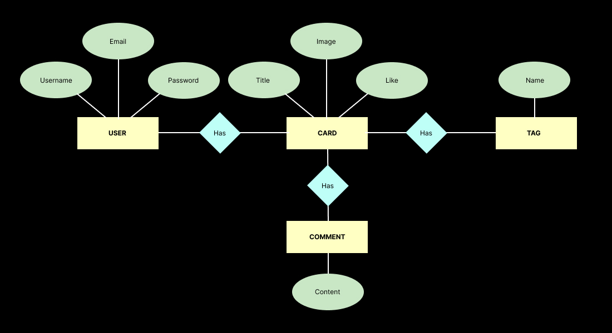
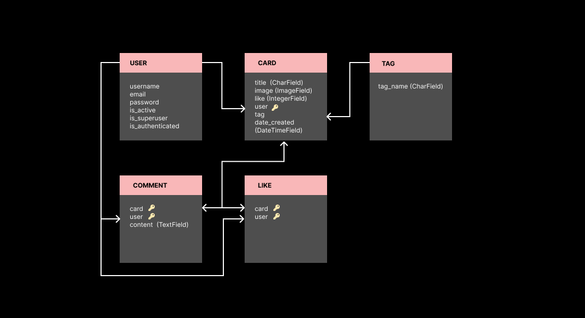

# Project 2

### WishCraft

## Groupe member

- Aleksandra
- André
- Andres
- Maiko
- Tischa

## Visuals

Wireframes, visual language guidelines, mockups are [HERE](https://www.figma.com/file/6IqDexekWDJsPdRIouBkYC/Wishcraft?type=design&node-id=0-1&mode=design&t=mrVceWbTknLxGIYi-0)

## Installation instruction:

- Create Virtual Environment ```python -m venv .venv```
- Activate the Virtual Environment:
  - For Unix/macOS: ```source .venv/bin/activate```
  - For Windows: ```.venv\Scripts\activate```
- Install Django ```pip install django```
- Verify Installation
```python -m django --version```
- Install pillow to add image processing capabilities
  - ```pip install Pillow```
  - ```python -m pip install pillow```
- Make Migrations - creates database ```python manage.py migrate```
- Create username for admin ```python manage.py createsuperuser```
- Start the server ```python manage.py runserver```

Note: if you are on mac you might need to use ```python3``` or ```pip3```

## Project architecture:

We were following Django general architecture with separating views according its function in the logic (authentication.py - login, sign up, sign out, cards.py - all manipulations with cards data, admin_panel.py - all manipulations with admin logic)

## Entity-Relationship Diagram and DB schema
- ERD

- DB shema
